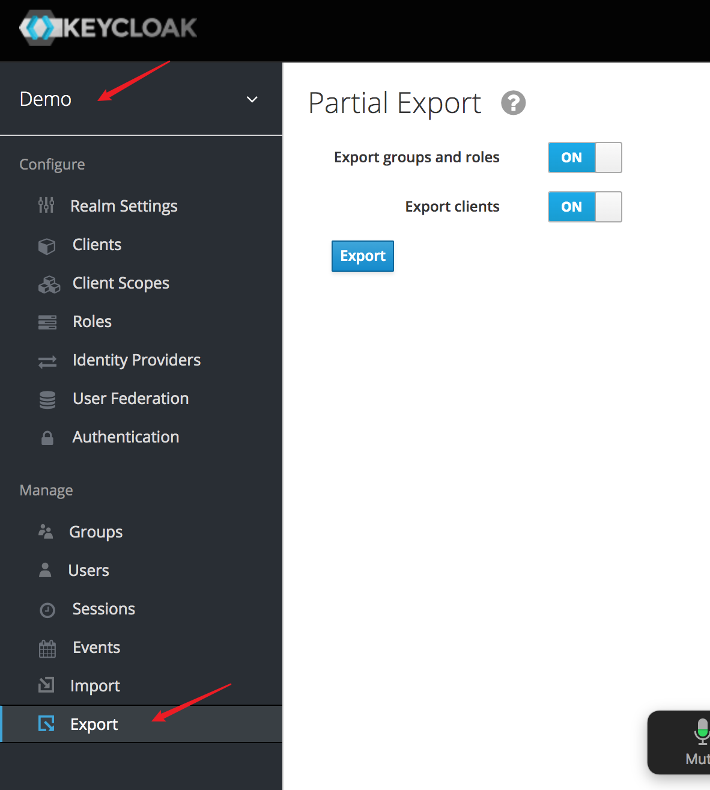
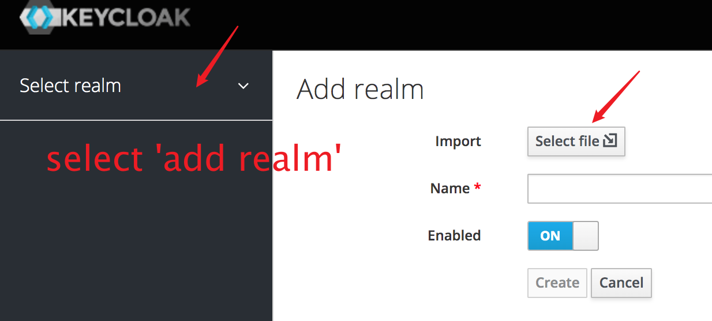
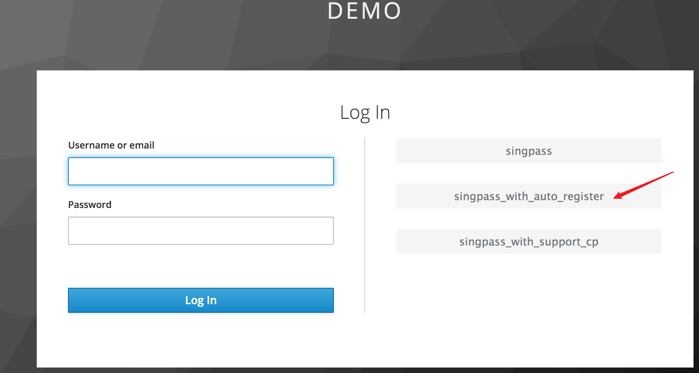

# Keycloak Plugin Integration With SP

## Export json file that keycloak has configured
1. export realm setting

1. import realm setting

1. Tips
    1. Click `Identity providers` choose `singpass -> OpenID Connect Config -> Client Secret`, rewrite secret by `tIo0D7UpXjpxsVvK`

## Mockpass has been customized repo
1. download mockpass from [github address](https://github.com/ThoughtWorksInc/SEA-SC-OpenID/tree/mockpass)
1. start mockpass service in local:
    1.  ```
        npm install
        export SHOW_LOGIN_PAGE=true
        npm start
        ```
1. how to sign and encrypt
    
    1. use spcp-csr.pem verify signature, use spcp-key.pem do the sign
    1. use key.pem encrypt idToken, use key.pub decrypt idToken
    you can see the code in `oidc.js`
1. tips:
    1. spcp-csr.pem is a certificate request not public key, if you want to covert it to public key you can run 
       `openssl req -in spcp-csr.pem -noout -pubkey -out spcp.pub`

## Simple integration with demo
1. download demo from [github address](); this demo achieves `login with roles` and `logout`

1. demo provides 5 APIs, you can check in demo -> KeycloakController.kt
    1. `http://localhost:8080/sso/keycloak/user`: allow `app-user` role login
    2. `http://localhost:8080/sso/keycloak/admin`: allow `app-admin` role login
    3. `http://localhost:8080/sso/keycloak/all-user`: allow `app-admin` and `app-user` role login
    4. `http://localhost:8080/sso/keycloak/logout`: user logout

1. start demo service, 
    1. visit `http://localhost:8080/sso/keycloak/user`, you will be redirect to keycloak, and choose singpass IDP
    
    
    2. you will be redirect to mockpass, and choose a user
    
    3. once login success, you will be redirect to demo, and see the basic user info 
    ```
    {
        "name": "0 s=S8979373D,u=0",
        "preferred_username": "s8979373d",
        "given_name": "0",
        "family_name": "s=S8979373D,u=0",
        "email": "s8979373d@placeholder.com",
        ...    
    }
    ```
1. tips
    1. if you got 403, that means the user you choose in mockpass isn't assigned a correct role.
       you can Assign a role to user as bellow:
       
    
    2. same user login with different IDP will be regard as different user.  
    
    
 
    
           

 