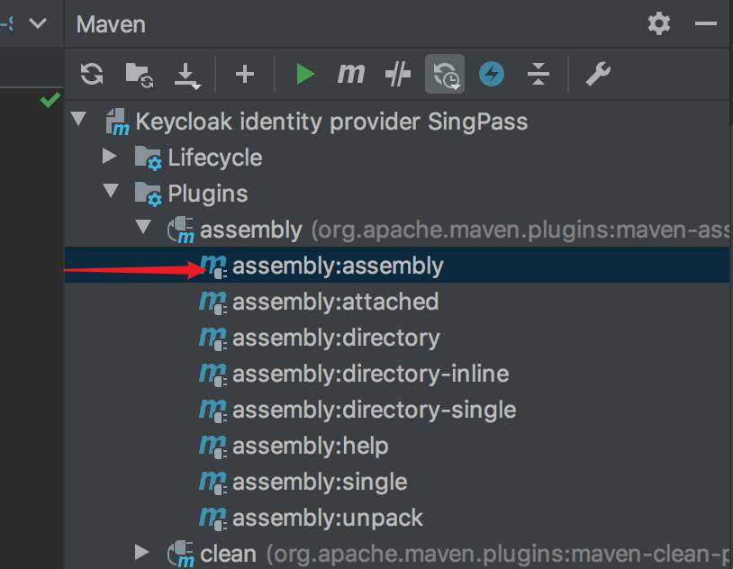
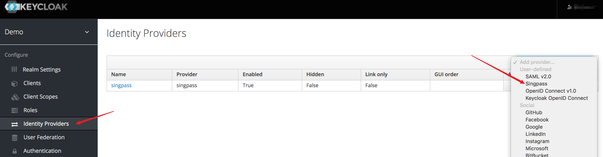
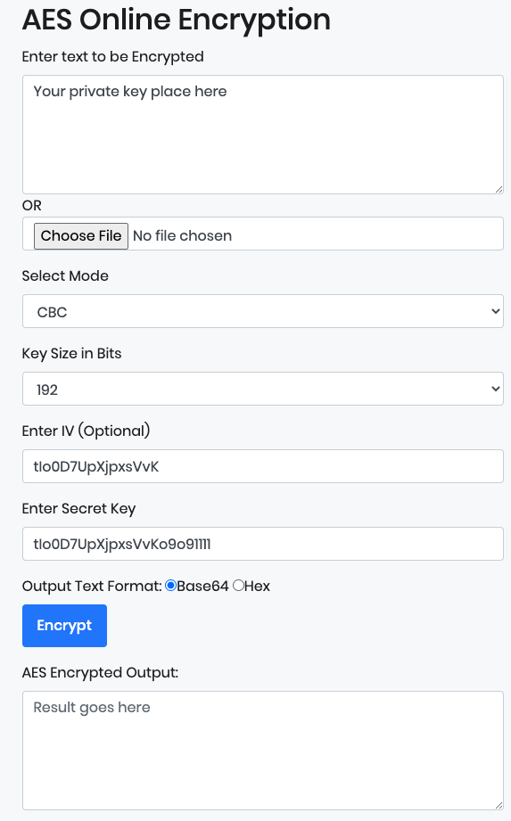

# Install And Config Keycloak Plugin - Keycloak-idp-singpass

## Install Keycloak
 there are two ways to install and start keycloak:
 - [By package](https://www.keycloak.org/docs/latest/getting_started/index.html)
 - [By Docker](https://hub.docker.com/r/jboss/keycloak/)

## Install Keycloak-idp-singpass plugin for Keycloak
- build keycloak plugin jar package
    
- copy `target/keycloak-idp-singpass-1.0.2-jar-with-dependencies.jar` to `$KEYCLOAK_HOME/standalone/deployments/`    

## Config IDP By Keycloak-idp-singpass
1. after starting keycloak then access the admin page to add an IDP

2. configuration

Before starting, generate SP's PrivateKey and PublicKey in [Online RSA Key Generator](https://travistidwell.com/jsencrypt/demo/), *generate config **Key Size** you can choose `2048bit`*

- Authorization URL: place singpass authentication request url like `https://host/authorize`
- Token URL: place singpass exchange token url like `https://host/token`
- Client ID: your client id registered to identity provider
- Client Secret: A shared secret code mutually agreed between SingPass OP and your RP, provided by singpass.
- Validate Signatures: turn on
- Use JWKS URL: turn off
- Validating Public Key: [Singpass public key OR certificate(SPK)](#how-to-exchanged-singpass-public-key)
- Encrypted Private Key: place [encrypted SP's private key](#how-to-encrypt-SP's-private-key)

### Tips

#### how to exchanged singpass public key
singpass public key exchanged in two ways:

    1. X509 certificate – this can be obtained via email by making a request to SingPass
    2. JWKS URL – this is a set of keys containing signing public keys. This can be obtained via JWKS URL(https://stg-saml-internet.singpass.gov.sg/mga/sps/oauth/oauth20/jwks/SingPassOP). The signing key which should be used for verification will be indicated by KID in the header of JWS message

#### how to encrypt SP's private key

Open Encrypted Online: [AES Encryption and Decryption Online Tool](https://www.devglan.com/online-tools/aes-encryption-decryption)

    1. Input your private key or select private key file
    2. MODE: `CBC`
    3. Key Size: `192`
    4. IV: `tIo0D7UpXjpxsVvK`
    5. Secret key: your `client secret`, the length of the `cilent secret` must be 24. If it is less than 24, it needs to be filled in with the string 1 on the right, and if it is greater than 24, the first 24 characters are used
    6. Output Text Format: `Base64`
    7. Copy the output, place in `Encrypted Private Key`

> Or use `AESUtils.encrypt` in `com.thoughtworks.provider.inspac.utils` (client secret does not need to be processed in advance)

## [Set Up SP and Keycloak SDK](https://github.com/ThoughtWorksInc/SEA-SC-Integration-Demo#how-to-integration-keycloak)

## [Check If It Works](https://github.com/ThoughtWorksInc/SEA-SC-OpenID/blob/keycloak/documents/How-To-Start-SEA-SC-Integration-Demo-Locally.md#run-sea-sc-integration-demo)
