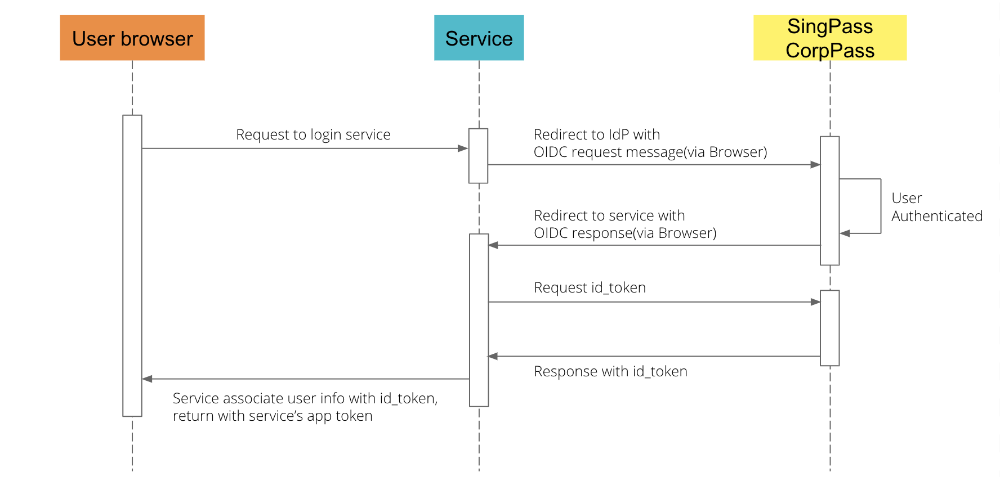

# Integration Demo of OIDC

- [What utilities does OIDC SDK provide](#What-utilities-does-OIDC-SDK-provide)
- [When to use the utilities of OIDC](#When-to-use-the-utilities-of-OIDC)


## What utilities does OIDC SDK provide

1. Generate an initiated authentication URL
2. Build token request with authorization code
3. Parse token to SubjectInfo/JSONObject


## When to use the utilities of OIDC

Please see :

1. When User browser sends a Login request, Service received it and redirect to Singpass.
    You need to generate an initiated authentication URL to redirect to Singpass. Code example:
    ```
    fun generateOIDCLoginURL(): String {
        val initAuthRequest = InitAuthRequest(
           oidcProperty.host,
           oidcProperty.login.endPoint,
           oidcProperty.clientId,
           oidcProperty.redirectURI
        )
        /*
          this example for saving nonce and state to verify token with ServletContext
          or you can choose other save methods
        */
        val nonce = initAuthRequest.nonce
        val state = initAuthRequest.state
        servletContext.setAttribute(state, nonce)
        return URLUtils.generateInitAuthURL(
           initAuthRequest
        )
    }
    ```

2. When Service wants to send Tokens request with authorization code. You need to generate a Token Request to send request. Code example:
    ```
    fun getOIDCToken(tokenTokenRequestParams: TokenRequestParams): TokenResponse? {
       val tokenRequest = TokenUtils.buildTokenRequest(tokenTokenRequestParams)
       val response = try {
           restTemplate.exchange(
               tokenRequest.url,
               HttpMethod.POST,
               tokenRequest.httpEntity,
               TokenResponse::class.java
           )
       } catch (e: RestClientException) {
           throw RestClientException("Request to S/C for getting token fails:", e)
       }

       return response.body
    }
    ```

3. When Service wants to parse response with Id-Token, the response returned after the request sent in the previous step.
    You need to parse Id-Token to get SubjectInfo or additional information. Code example:
    ```
    internal fun parseToServiceToken(token: TokenResponse, state: String): Map<String, String> {
        val parseTokenParams = ParseTokenParams(
            // this example for extract nonce from servletContext by state for the OIDC token verification
            servletContext.getAttribute(state) as String,
            oidcProperty.host,
            oidcProperty.clientId,
            oidcProperty.token.identityProviderPublicKey,
            oidcProperty.token.servicePrivateKey
        )
        servletContext.removeAttribute(state)
        val (nric, uuid) = TokenUtils.parseTokenToSubjectInfo(token, parseTokenParams)
        /*
        this example for connecting user from IdP with service's user record
        maybe you need to implement your own token issuer
        */
        return mapOf(
            "nric" to (nric ?: ""),
            "uuid" to uuid
        )
    }
    ```
